# 📈 Next 200 — KOSPI200 편입·편출 예측 서비스

> **Team NUMBERS** | 2026상반기
> KOSPI200 정기 변경 시점에 편입·편출 예상 종목을 머신러닝으로 사전 예측하는 웹 서비스

<p align="center">
  
</p>

---

## 📌 목차

1. [프로젝트 개요](#-프로젝트-개요)
2. [서비스 목표](#-서비스-목표)
3. [주요 기능](#-주요-기능)
4. [데이터 수집 방식](#-데이터-수집-방식)
5. [모델 개발 과정](#-모델-개발-과정)
6. [시스템 아키텍처](#-시스템-아키텍처)
7. [ERD](#-erd)
8. [UI 화면](#-ui-화면)
9. [수익률 분석](#-수익률-분석)
10. [기술 스택](#-기술-스택)
11. [프로젝트 회고](#-프로젝트-회고)

---

## 🔍 프로젝트 개요

KOSPI200은 한국 주식시장을 대표하는 지수로, **매 반기(6월·12월)마다 구성 종목이 변경**됩니다.
편입 예정 종목은 발표 전부터 시장 반응이 선반영되는 경향이 있어, 이 정보는 투자자에게 **높은 투자 기회**를 제공합니다.

하지만 대부분의 개인 투자자는 편입 규칙·리밸런싱 일정에 대한 **정보 접근이 어렵고**, 체계적인 분석 없이 단순 시총 순위만으로 판단하는 경우가 많습니다.

**Next 200**은 이 예측을 머신러닝 기반으로 자동화하고, 누구나 쉽게 활용할 수 있도록 웹 서비스로 구현했습니다.

---

## 🎯 서비스 목표

> KOSPI200 정기 변경 사전 예측 및 지수 관련 종합 데이터 제공을 통해 정보 비대칭을 완화하고 개인 투자자들의 투자 판단을 지원하는 서비스


| 페르소나 | 페인 포인트 | 해결 방향 |
|---------|-----------|---------|
| 단기 트레이딩 성향 개인 투자자 | 편입 규칙·타이밍 정보 부재 | 자동화된 예측 결과 제공 |
| 퀀트 스타일 IT 투자자 | 데이터 수집~모델 구축까지 높은 기술 장벽 | 분석 결과 및 피처 기여도 시각화 |

---

## ⚙️ 주요 기능

| 기능 | 설명 |
|-----|-----|
| 편입·편출 종목 예측 | KOSPI200 편입·편출 후보 종목 랭킹 제공 |
| 강력 편입·편출 판별 | 전기 비구성원 → TOP200 진입 / 전기 구성원 → TOP200 탈락 종목 강조 |
| 모델 근거 설명 | 종목별 SHAP 피처 기여도 시각화 |
| 과거 결과 조회 | 반기별 과거 예측 결과 및 실제 편입·편출 비교 |
| 부가 기능 | 개별 주가 시계열, 관련 뉴스 링크, CSV 다운로드, 이메일 구독 알림 |
| 편입 여부 표기 | `is_member`, `label_in`, `label_out` 컬럼 포함 CSV 제공 |

---

## 📊 데이터 수집 방식

### 수집 소스

| 소스 | 수집 데이터 |
|-----|-----------|
| **KRX** | 주간 종가, 시가총액, 거래량, 유동비율 등 시세 데이터, 외국인 보유량 등 |
| **DART** | 주요 주주 지분율, 자사주 비율, 비유동 비율 |
| **GICS** | 섹터 분류 정보 |
| **ECOS** | 거시경제 지표 (매크로) |
| **Naver** | 상장주식수, 유동비율, 외국인지분율, 주요주주, 자사주, 업종, 현재가, 등락률, 코스피 현재지수 |
| **Yahoo** | 가격, 거래량, 장기 차트 데이터 |

### 수집 기준

- **수집 주기**: 매주 토요일 자동 수집
- **반기 기준일**: H1 → 4월 30일 / H2 → 10월 31일 기준 가장 가까운 금요일
  *(해당일이 휴일·휴장이면 전일로 대체)*
- **DB 저장 테이블**: `kospi_friday_daily`

### Data Flow

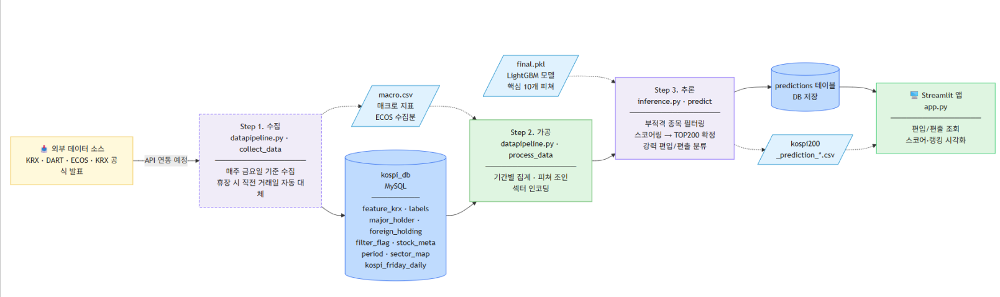

### 데이터 커버리지

| 구분 | 기간 |
|-----|-----|
| 학습 데이터 | 2020_H1 ~ 2024_H2 (총 10개 반기) |
| 모델 검증 | 2025_H1 ~ 2025_H2 (2개 반기) |
| 현재 예측 제공 | 2026_H1 |
| 시세 데이터 범위 | 2019.05 ~ 2026.03 |

### 데이터 품질 관리 (EDA)

DART 수집 주요 주주 데이터(`non_float_ratio`, `treasury_shares`, `major_holder_ratio` 등)에서 이상값이 다수 발견되어, **11차례에 걸쳐 수동 검토 및 수정**을 진행했습니다. 이 과정이 모델 신뢰도를 높이는 핵심 전처리였습니다.

---

## 🤖 모델 개발 과정

### Pipeline

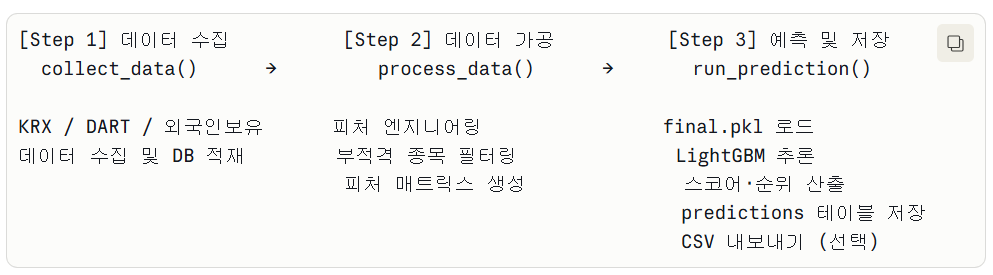

### Baseline 실험 흐름

1. **분리 모델 (Baseline 1)**: 편입/편출 별도 학습 + 시간 가중치 적용
2. **Rule-based 가중치 모델 (Baseline 2)**: 유동주식비율·시가총액 순위 등 4개 피처 기반 가중치 모델 → ML 대비 성능 열위로 기각
3. **단일 모델**: 편입·편출을 하나의 스코어링 모델로 통합 → **성능 향상 (17.1% → 39.0%)**

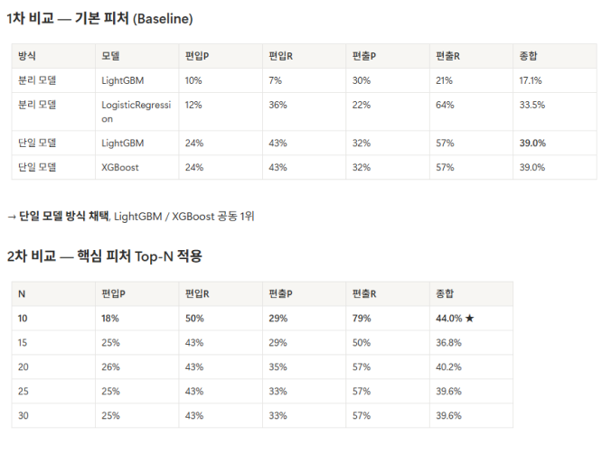

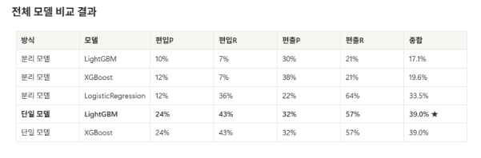

### 최종 모델 성능

| 구분 | 지표 | 값 |
|-----|-----|---|
| 최종 모델 | 단일 LightGBM | |
| 종합 정확도 (강력 편입·편출) | Precision@20 | **44.0%** |
| TOP200 분류 | AUC | 93.3% ± 1.8% |
| 교차검증 | TimeSeriesSplit | 5-Fold |

### 핵심 피처 (Top 10)

| 피처 | 출처 | 설명 |
|-----|-----|-----|
| `period_rank` | KRX | 해당 반기 시가총액 기준 순위 |
| `prev_rank` | KRX | 전기 시가총액 순위 |
| `rank_change` | 파생 | 시가총액 순위 변화량 (음수 = 순위 상승) |
| `float_mktcap` | KRX | 유동 시가총액 |
| `turnover_ratio` | KRX | 거래 회전율 |
| `float_ratio` | KRX | 유동비율 |
| `major_holder_ratio` | DART | 대주주 지분율 |
| `treasury_ratio` | DART | 자사주 비율 |
| `non_float_ratio` | DART | 비유동 비율 |
| `foreign_change` | 외국인보유 | 외국인 보유 비율 전기 대비 변화량 |
| `was_member` | labels | 전기 KOSPI200 구성 여부 (단일 모델 핵심) |

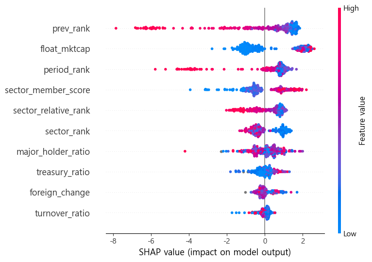

### 피처 중요도 경제적 해석

- **순위 변화량 (`rank_change`)**: 편입·편출 그룹 간 분포 차이가 가장 뚜렷 → 핵심 피처
- **외국인 수급 변화 (`foreign_change`)**: 외국인 자금 유입이 편입 신호와 연관
- **섹터·매크로 피처**: Ablation Study 결과 오히려 노이즈로 작용 → 최종 제외
- **`actual_rank` 제외**: 발표 이후에야 알 수 있는 값으로, Data Leakage 방지를 위해 학습 데이터에서 제외

---

## 🏗️ 시스템 아키텍처

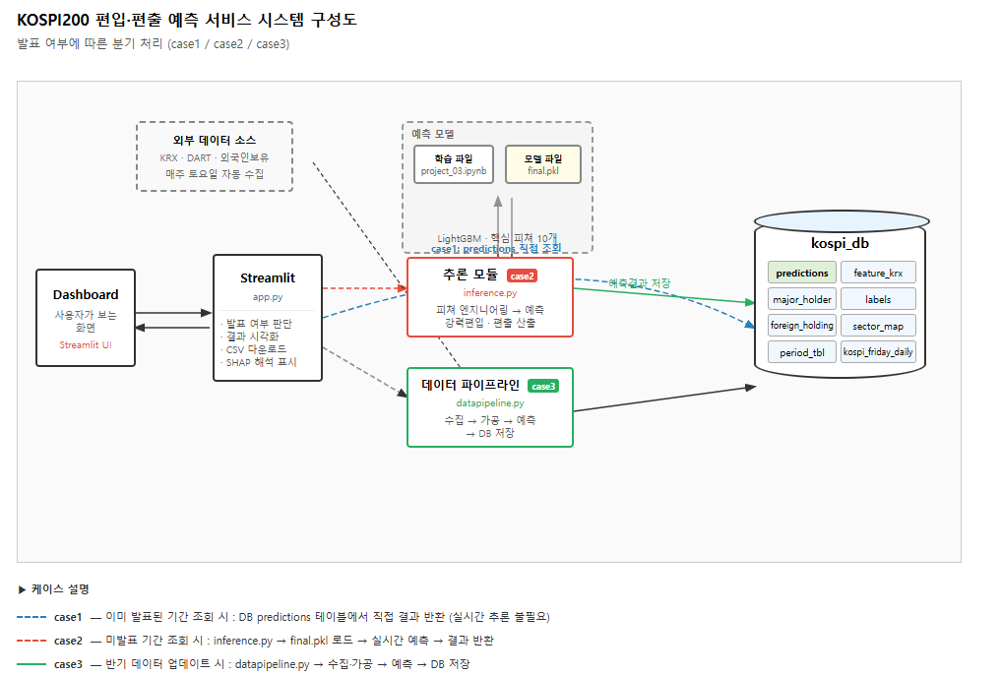

서비스는 **3가지 케이스**로 작동합니다:

| Case | 상황 | 처리 방식 |
|------|-----|---------|
| **Case 1** | 이미 발표된 기간 | DB `predictions` 테이블 직접 조회 |
| **Case 2** | 미발표 기간 (현재 반기) | `inference.py` 실시간 예측 |
| **Case 3** | 반기 데이터 업데이트 | `datapipeline.py` 수집 → 예측 → DB 저장 |

### 주요 구성 파일

```
Next200/
├── app.py                      # Streamlit 메인 앱
├── inference.py                # 실시간 예측 모듈
├── final.pkl                   # 학습된 LightGBM 모델
│
├── datapipeline/
│   ├── collector.py            # 외부 데이터 수집 (KRX·DART·외국인보유 등)
│   ├── builder.py              # 피처 가공 및 DB 적재
│   ├── run_weekly_collection.py  # 주간 주가 수집 실행 (매주 토요일)
│   └── run_weekly_prediction.py  # 주간 예측 실행
│
└── data/
    └── kospi_db                # MySQL DB (kospi_friday_daily, labels, predictions 등)
```

---

## 🗄️ ERD

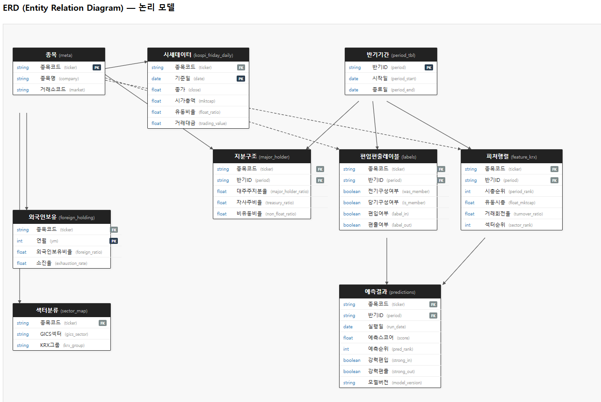

### 주요 테이블

| 테이블 | 설명 |
|-------|-----|
| `meta` | 종목 기본 정보 (ticker, 상장일, 섹터 등) |
| `kospi_friday_daily` | 매주 금요일 기준 시세 데이터 |
| `period_tbl` | 반기 기간 정보 |
| `labels` | 반기별 실제 편입·편출·구성 여부 |
| `feature_krx` | 반기별 가공된 KRX 피처 |
| `major_holder` | DART 주요 주주 정보 |
| `foreign_holding` | 외국인 보유 비율 |
| `predictions` | 모델 예측 결과 저장 |
| `sector_map` | GICS 섹터 매핑 |

---

## 💻 UI 화면

### 메인 대시보드 — 편입·편출 예측

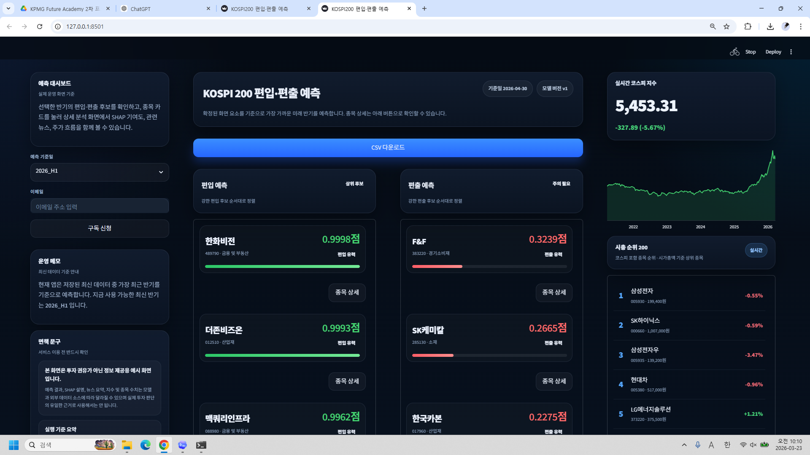

### 종목 상세 — SHAP 기여도 · 주가 추이 · 관련 뉴스

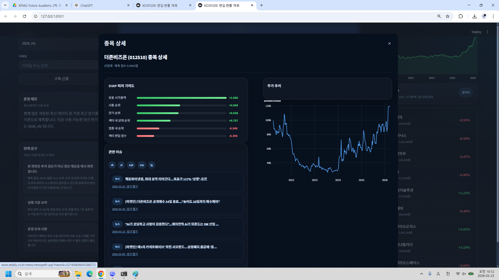

### 섹터 비율 분석

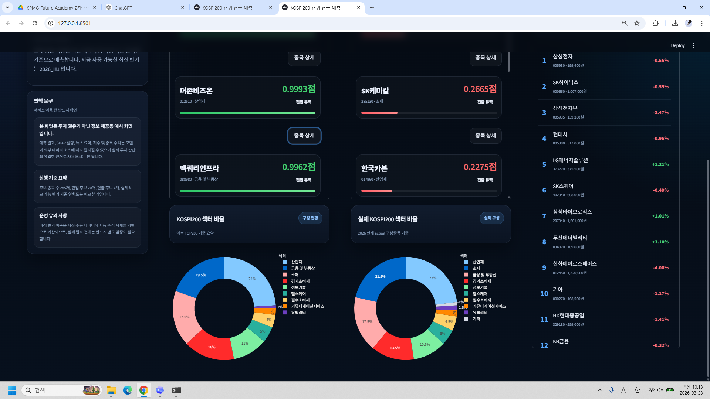

### 이메일 구독 알림

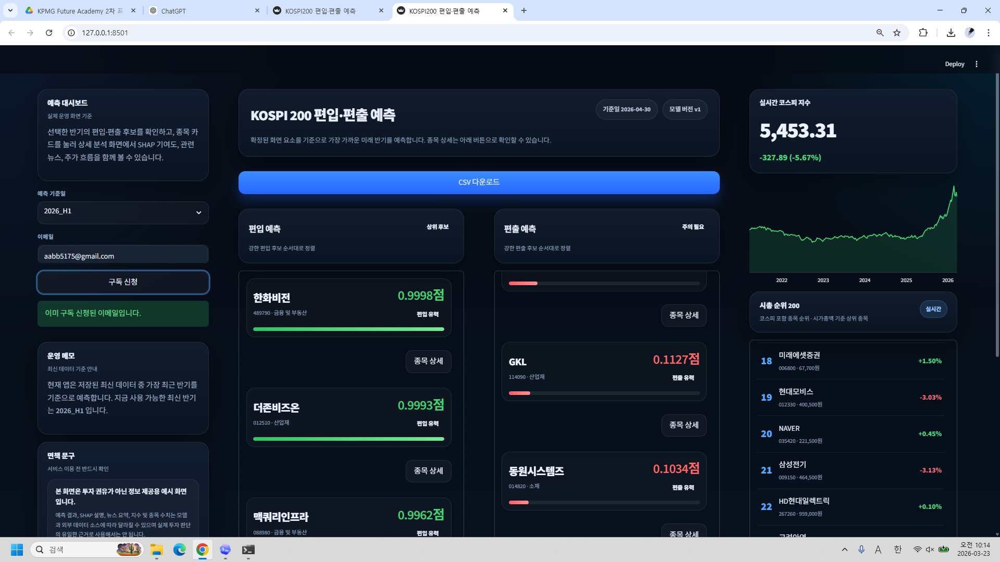

### CSV 다운로드

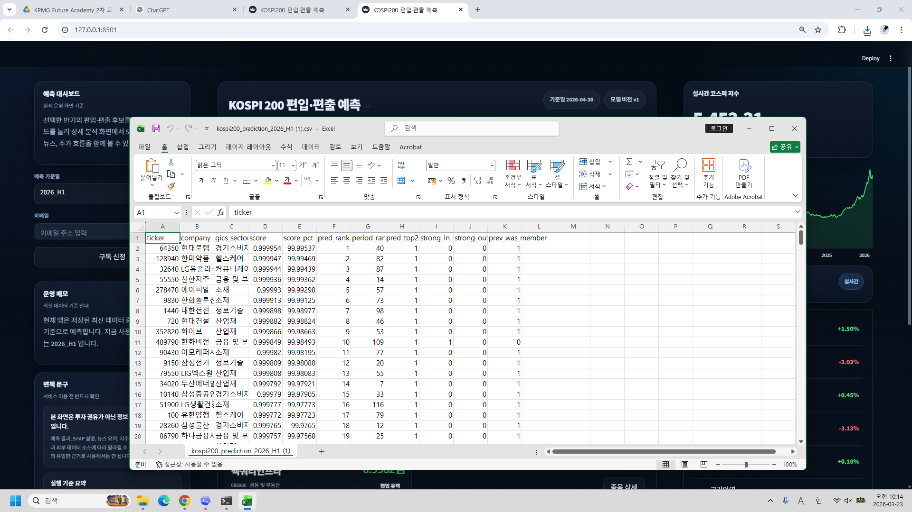

---

## 📈 수익률 분석

모델이 예측한 **강력 편입 종목**을 매수일(5/1 이후 첫 거래일)에 매수하고
매도일(6월 둘째 주 금요일)에 매도했을 때의 수익률을 검증합니다.

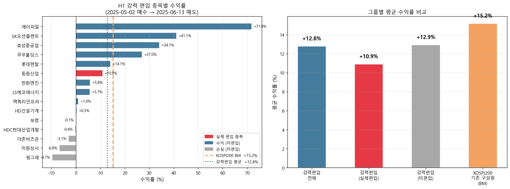

### 기간별 strong_in / strong_out 수익률 비교

`2020_H2 ~ 2025_H2` 구간에서 `strong_in`, `strong_out`, 그리고 KOSPI200 벤치마크의 평균 수익률을 비교했습니다.

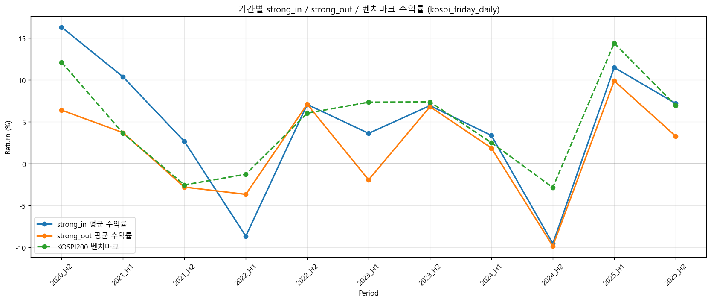

### 기간별 strong_in / strong_out 정밀도 분석

기간별로 `precision`과 함께 `예측 수 / 실제 수 / 적중 수`를 비교해 모델이 실제 편입·편출 종목을 얼마나 정확히 포착했는지 확인했습니다.

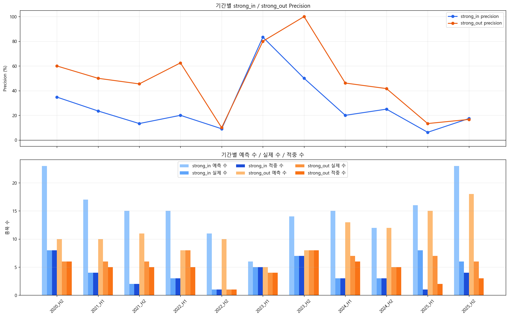

| 구분 | 평균 수익률 |
|-----|-----------|
| 강력편입 전체 | **+12.8%** |
| 강력편입 (실제 편입 종목) | +10.9% |
| 강력편입 (미편입 종목) | +12.9% |
| KOSPI200 기존 구성원 (BM) | +15.2% |

---

## 🛠️ 기술 스택

| 분류 | 기술 |
|-----|-----|
| **언어** | Python 3.10+ |
| **ML 프레임워크** | LightGBM, XGBoost, scikit-learn |
| **웹 서비스** | Streamlit |
| **데이터베이스** | MySQL |
| **데이터 수집** | KRX OpenAPI, DART API, ECOS API |
| **시각화** | SHAP, Matplotlib, Plotly |
| **버전 관리** | Git / GitHub |
| **협업** | Notion, Figma |

---

## 🔁 프로젝트 회고

### 1. 프로젝트 개요

- **프로젝트 이름**: Next 200 — KOSPI200 편입·편출 예측 서비스
- **기간**: 2026-03-11 ~ 2026-03-24
- **팀 구성원**:

| 이름 | 역할 |
|-----|-----|
| 고휘주 | 팀장, 데이터 수집·DB 구축, 프로젝트 총괄 |
| 손소희 | 모델 개발, 피처 엔지니어링 |
| 유태상 | 서비스 개발 (Streamlit, inference.py) |

---

### 2. 회고 주제

#### 2.1 잘한 점 (What went well)

- **End-to-End 구현**: 데이터 수집 → DB 설계 → 피처 엔지니어링 → 모델 학습 → 웹 서비스 배포까지 전 과정을 직접 구축
- **다중 소스 파이프라인 구축**: KRX·DART·ECOS·외국인보유 등 여러 외부 API를 통합하는 자동 수집 파이프라인 구현
- **근거 있는 모델 선정**: 분리 모델·Rule-based·단일 모델을 직접 실험하고 비교하여 단일 LightGBM으로 성능 향상 달성 (17.1% → 44.0%)
- **데이터 무결성 검증**: CSV 파일의 실제편입 라벨 오류를 발견하고, DB labels 테이블 기준으로 정정하여 신뢰성 확보
- **모델 해석 가능성 확보**: SHAP TreeExplainer를 활용해 종목별 예측 근거를 경제적으로 해석 가능한 형태로 제공

#### 2.2 개선이 필요한 점 (What could be improved)

- **모델 성능 고도화 필요**: 현재 종합 정확도 44.0% 수준으로, 전기 `actual_rank` 피처 활용 등 피처 실험 및 하이퍼파라미터 튜닝을 통한 성능 개선 여지가 있음
- **데이터 단위 세분화**: 현재 주별 집계 데이터 기반에서 일별 데이터로 전환하여 보다 세밀한 시세 흐름 반영
- **서비스 응답 속도 개선**: Streamlit 초기 로딩 시 데이터 조회 및 모델 추론 과정에서 발생하는 지연 최소화
- **종목 범위 확대**: KOSPI200을 넘어 S&P500, MSCI 등 글로벌 지수로 서비스 확장 검토


#### 2.3 배운 점 (Lessons learned)

- **Data Leakage의 중요성**: `actual_rank`처럼 미래 정보가 포함된 피처를 학습에 사용하면 실전에서 무용지물이 됨을 직접 실험으로 확인
- **모델 성능 지표의 다양한 해석**: AUC만으로는 부족하고 Precision@N, Recall 등 비즈니스 목적에 맞는 지표 선정이 중요함을 경험
- **Ablation Study의 실용성**: 섹터·매크로 피처가 오히려 노이즈임을 Ablation Study로 객관적으로 증명하는 방법 습득


---

### 3. 프로젝트 주요 결과 요약

- **성과**
  - KOSPI200 편입·편출 강력 후보 종목 예측 모델 개발 (종합 정확도 44.0%)
  - KRX·DART 기반 자동 수집 파이프라인 및 MySQL DB 구축
  - Streamlit 기반 예측 대시보드 서비스 배포
- **결과물**
  - 🔗 GitHub: [https://github.com/sohson/fa08-2nd-Numbers](https://github.com/sohson/fa08-2nd-Numbers)

---

> 📅 2026 상반기 | Team NUMBERS | Next200
